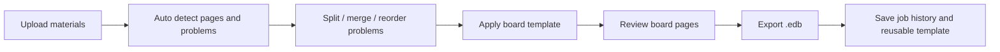

# EDB UI/UX Product Design

## 1. Product Goal

The product should help three main users turn scattered teaching materials into a single exportable `.edb` package for ClassIn:

- academy teachers
- academy directors
- content managers

The user should not need to think in terms of binary `.edb` internals. The product should present the work as:

`collect materials -> extract problems -> review layout -> export EDB`

## 2. Core User Jobs

### Teacher

- Quickly gather problems from PDFs, scans, and existing exam sheets
- Make one lesson-ready EDB with minimal manual work
- Keep enough empty board space for live explanation

### Director

- Standardize lesson material quality across teachers
- Review whether the exported board follows academy layout rules
- Reuse approved templates and layouts

### Content Manager

- Clean raw content at scale
- Split and group problem units accurately
- Maintain consistent metadata, ordering, and export quality

## 3. Product Language

To reduce user confusion, the UI should avoid exposing low-level technical terms early.

- `Source material`: uploaded PDF, image, or scan
- `Problem`: the smallest reviewable content unit
- `Board page`: one page in the final ClassIn board
- `EDB package`: final export artifact
- `Template`: reusable placement rule for board layout

The word `.edb` should appear mainly at export time and in job history.

## 4. Default Board Assumptions

These are the current product assumptions based on the ClassIn board usage described for this project.

- One exported board contains about `50 pages`
- `1 problem = 1 board page` is the default mental model for users
- Each problem is placed in a fixed left-side content zone
- The right side is preserved as teaching and writing space
- The effective placement slot should be treated as `1.2 page height`
- Problem placement should align to a repeating `1.2 page` vertical grid
- Korean reading passages and other long-stem problems may overflow beyond the base `1.2 page` slot
- When overflow happens, the next problem should start at the next available `1.2 page` boundary after the actual occupied height
- Problem cards should keep a consistent visual size across pages

This means the system is not a freeform whiteboard editor first. It is a structured lesson-board generator first.

## 5. Primary UX Strategy

The most important UX choice is to make users review content by `problem unit`, not by raw page image.

Why this matters:

- teachers think in problems, not OCR blocks
- directors think in lesson packs and consistency
- content managers need precise split and merge controls

So the UI should always maintain two synchronized views:

- `Source view`: original PDF page or scan
- `Problem view`: extracted problem cards and target board pages

Preview is not optional in this product. It should be a first-class workflow surface because users need to trust:

- image order
- split and merge results
- actual board placement
- overflow and stair-step behavior

## 6. Main User Flow



## 7. Recommended Screen Structure

### Screen 1. Dashboard

Purpose:

- start a new EDB job
- reopen recent jobs
- access approved templates
- check export status and failures

Main UI blocks:

- `New EDB` primary action
- recent jobs list
- template library
- export history
- role-based shortcuts

Recommended shortcuts by role:

- Teacher: `Quick lesson pack`
- Director: `Review for approval`
- Content Manager: `Problem extraction review`

### Screen 2. New EDB Wizard

This should be a step-based flow, not a dense single screen.

#### Step 1. Collect Materials

Goal:

- gather PDFs, images, and previous source files into one job

UI:

- drag-and-drop upload zone
- file list with page counts and source type
- folder or batch upload support
- tag fields: subject, grade, exam type, lesson name

Key usability points:

- auto-detect source type
- show upload order clearly
- allow simple drag reorder before extraction

#### Step 2. Detect Problems

Goal:

- convert page-level materials into reviewable problem units

Layout:

- left panel: source page thumbnails or filmstrip
- center: original page preview
- right panel: detected problem cards

Actions:

- split problem
- merge neighboring problems
- mark decorative area as ignore
- label question number
- reorder within source

This is the most important editor for content managers.

### Recommended Editing Model: PDF-Like Filmstrip Editor

For most users, editing should feel closer to a simple PDF editor than a design tool.

Why this works:

- teachers already understand page thumbnails and drag reordering
- users can fix order mistakes quickly without learning a canvas editor
- the system stays focused on content packaging, not freeform composition

Recommended editor structure:

- left: filmstrip of uploaded pages or extracted problems
- center: large preview
- top toolbar: simple edit actions
- bottom or right: metadata and board placement summary

Recommended simple actions:

- drag to reorder
- rotate
- crop
- split
- merge
- delete
- duplicate
- mark as ignore
- insert separator or blank page

Important principle:

- simple edits should happen directly from the preview, without modal-heavy workflows
- advanced editing should be hidden behind `More`
- the default user should feel they are cleaning and arranging pages, not operating a publishing tool

#### Step 3. Apply Board Layout

Goal:

- map each problem card onto the target ClassIn board structure

Layout:

- left panel: problem list
- center: board preview
- right panel: layout properties

Board preview behavior:

- show 50-page vertical board overview
- show one page at a time or a continuous strip mode
- highlight the left fixed problem zone
- visualize the extra `1.2 page` height safety area
- show snapped `1.2` grid lines across the board
- show actual occupied height and the snapped next-start line for overflowed problems
- warn when content overflows template bounds

Recommended preview modes:

- `Source Preview`: uploaded image or PDF page
- `Problem Preview`: extracted problem crop
- `Board Preview`: final placement on the ClassIn board

Users should be able to switch these three views quickly for the same item.

Layout controls:

- template selector
- problem size preset
- start page
- page gap
- optional blank pages between sections
- subject-specific template presets
- overflow rule selector for long-stem content
- snapped next-start preview

#### Step 4. Review and QA

Goal:

- ensure what was extracted matches what will be exported

Review modes:

- `Problem QA`: source problem vs processed problem
- `Board QA`: board page preview vs source problem
- `Export QA`: final sequence, naming, metadata

Critical checks:

- missing stem text
- broken formula or diagram crops
- wrong problem split
- overflow from fixed left area
- incorrect next-start snap after long content
- page order mismatch

#### Step 5. Export

Goal:

- generate final `.edb` package and a traceable job record

UI:

- export button
- export summary
- package name
- template used
- problem count
- page count
- generation log

Recommended outputs:

- `.edb` file
- review snapshot images
- job metadata JSON for reproducibility

### Screen 3. Job Detail / History

Purpose:

- reopen old jobs
- clone a successful lesson pack
- audit what changed before re-export

Important fields:

- source materials
- editor actions
- template version
- exported file path
- success or failure state

### Screen 4. Quick Sequence Editor

This is an optional fast lane for users who mainly want to sort images and export quickly.

Best fit:

- teachers preparing class material quickly
- users working from image batches
- users who already trust the auto-detection and mainly need sequencing

Layout:

- top: bulk actions
- left or bottom: page or problem filmstrip
- center: big preview
- right: simple properties panel

Bulk actions:

- reorder selected items
- move to top or bottom
- group into one lesson pack
- apply one template to all
- delete ignored items

This quick editor should feel like:

`image sorter + lightweight PDF editor + board preview`

## 8. Recommended Layout Pattern

The center preview in layout and QA screens should follow this pattern:

```text
+--------------------------------------------------------------+
| Top bar: Job name | Subject | Template | Export status       |
+------------------+-------------------------------------------+
| Left panel        | Center preview                           |
| Problem list      | Board page preview                       |
| - #1              | [fixed left problem zone]                |
| - #2              | [right teaching/writing zone]            |
| - #3              |                                           |
|                   | overflow / alignment guides               |
+------------------+--------------------------+----------------+
| Bottom strip: page sequence / problem-to-page mapping        |
+--------------------------------------------------------------+
```

This structure supports both editing and QA without forcing users to switch mental models.

## 9. Placement Engine Rules

The layout engine should follow a strict but readable rule set.

### Base Rule

- Every problem is assigned a start position on the vertical board
- The nominal slot height is `1.2 page`
- Normal problems should fit inside one slot when possible

### Long Content Rule

- Long Korean passages, long reading comprehension stems, and similar tall content may extend past the nominal slot height
- Overflow is allowed only downward within the fixed left content zone
- The system should preserve readability first and avoid shrinking the content too aggressively just to stay inside the slot

### Stair-Step Rule

If a problem occupies more than one nominal slot, the next problem should not start immediately under the visible content edge. It should start at the next snapped `1.2 page` boundary.

Conceptually:

`next_start = ceil(actual_bottom / 1.2) * 1.2`

This creates the intended staircase layout:

- problem A starts at `0.0`
- problem A visually ends at `1.46`
- problem B starts at `2.4`
- problem B visually ends at `3.05`
- problem C starts at `3.6`

### UX Requirement For Stair-Step Layout

- the preview should draw both the actual content bottom and the snapped next-start line
- users should understand that overflow is accepted, but overlap is never accepted
- if the snapped next-start pushes content too far down, the UI should recommend splitting into another lesson pack or another board
- users should be able to fix order or remove an item without leaving the preview flow

### Subject-Aware Default

- math and science: prefer keeping within the base slot when possible
- korean and reading-heavy material: allow overflow first, snap next problem afterward
- mixed exams: apply the rule per problem, not per whole file
## 10. Role-Based UX Emphasis

### Teacher Mode

- fastest happy path
- fewer controls
- strong defaults
- template-first
- bulk import and quick export

Recommended default CTA:

- `Auto-split and place problems`

### Director Mode

- approval and consistency first
- compare against academy template
- lock approved layout presets
- require QA completion before export approval

Recommended default CTA:

- `Review and approve`

### Content Manager Mode

- detailed split, crop, and metadata tools
- keyboard-friendly review workflow
- batch editing
- confidence and warning surfacing

Recommended default CTA:

- `Start extraction QA`

## 11. High-Value Usability Rules

- Default to `one problem per page`; users should opt out, not opt in
- Keep the board visually aligned to the `1.2 page` grid even when some problems overflow
- Always show where the problem came from in the original source
- Make reordering feel like moving pages in a PDF sidebar
- Never hide page order changes; show them visually
- Use warnings instead of silent auto-fixes when overflow occurs
- Preserve source-to-problem traceability for every export
- Let users review with thumbnails before opening detailed edit mode
- Support batch operations for content managers
- Keep export naming consistent and reusable

## 12. MVP Scope

The first product version should focus on predictability over flexibility.

### Must Have

- batch upload
- automatic problem extraction draft
- split / merge / reorder
- fixed board template preview
- one-problem-per-page default layout
- export job history

### Should Have

- subject-based presets
- QA warnings
- reusable template presets
- board page mapping summary

### Later

- advanced freeform placement
- collaborative review comments
- approval workflow with roles and permissions
- analytics on lesson pack reuse

## 13. Implementation Notes For This Repo

This UX design aligns well with the current pipeline direction in this repository:

- `structured_schema.py` can represent extracted problem units
- `assemble_page.py` can group OCR blocks into problem-level objects
- the next product layer should add a job model above page parsing
- the next layout layer should store both `actual_content_height` and `snapped_start_y`

Suggested next engineering artifacts:

1. `job_schema.py`
2. `layout_template_schema.py`
3. `review_state_schema.py`
4. `placement_engine.py`
5. a lightweight web or desktop prototype for the 5-step wizard

## 14. Decision Summary

The product should be positioned as:

`a structured EDB lesson-board builder for problem-based teaching`

not as:

`a generic whiteboard editor`

That framing matches the ClassIn board constraint, the fixed left placement pattern, and the users' real goal of turning many problems and exam sheets into one clean teaching-ready `.edb`.
